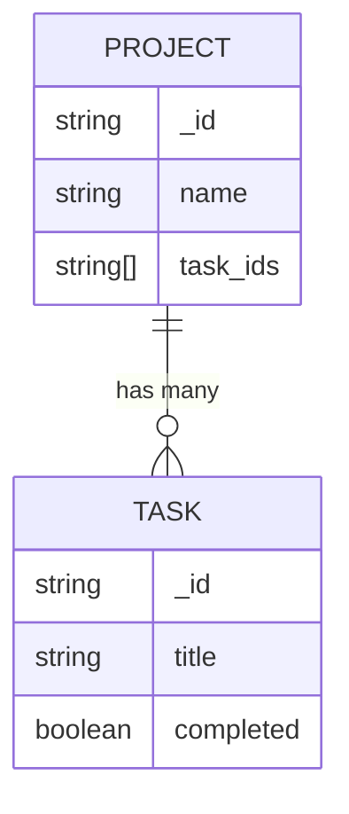
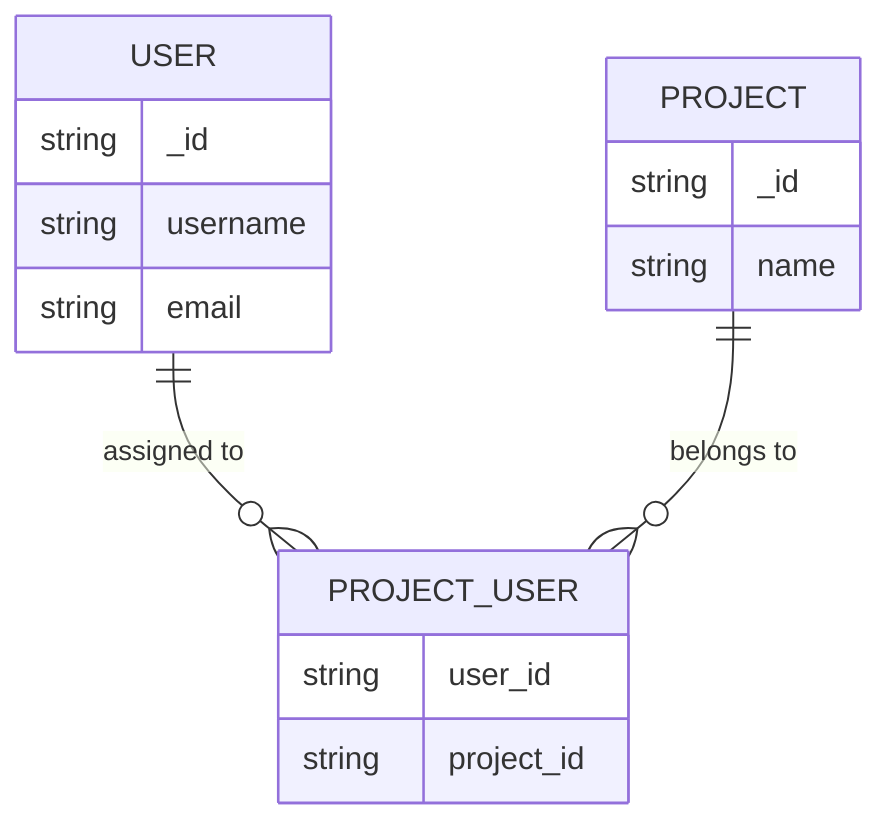
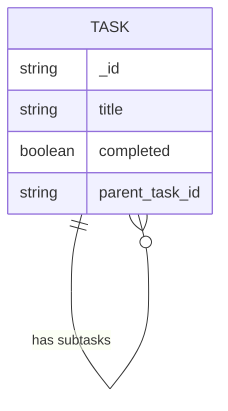

# API Development Plan

## Overview

Build a Task Management App backend that allows users to manage projects, tasks, and subtasks with shared collaboration features, applying all required MongoDB schema patterns, OOP principles, and best practices for study purposes.

## Functional Requirements

1. **User Management**

   - Users can register, log in, and manage their profiles.
   - Authentication and authorization should be implemented using JWT (JSON Web Token).
   - Users can reset their passwords via email.

2. **Project Management**

   - Users can create, read, update, and delete projects.
   - Users can invite other users to collaborate on their projects (many-to-many relationship).

3. **Task Management**

   - Each project can have multiple tasks (one-to-many relationship).
   - Tasks can have subtasks (tree structure).
   - Users can update task status, due dates, and priorities.

4. **Categorization and Filtering**

   - Tasks can be categorized into folders and filtered by status, due date, and priority.
   - Projects and tasks should support pagination and sorting.

5. **Notifications**

   - Users receive notifications when they are invited to projects or when a task assigned to them is updated.

6. **Activity Logs**

   - Maintain logs of actions (e.g., task creation, updates, and deletions) for auditing purposes.

7. **API Documentation**
   - Use Swagger to provide API documentation for all endpoints.

## Non-Functional Requirements

1. **Scalability:**

   - The system should handle multiple users and tasks efficiently. Use Redis for caching frequently accessed data (e.g., user profiles, projects).

2. **Security:**

   - Implement JWT for authentication and role-based access control (RBAC) for authorization.
   - Set HTTP Security Headers like `Content-Security-Policy` (CSP), `X-Content-Type-Options`, `Strict-Transport-Security` (HSTS), `X-Frame-Options`, and `X-XSS-Protection` to protect against common web vulnerabilities.

3. **Performance:**

   - Apply indexing in MongoDB for faster querying.

4. **Error Handling:**

   - Implement comprehensive error handling with meaningful messages and HTTP status codes.

5. **Maintainability:**

   - Follow clean code practices, SOLID principles, and modular architecture.

6. **Testing:**

   - Implement unit and integration tests using `pytest` for backend functionality.

7. **Logging & Monitoring:**
   - Integrate logging using Python’s `logging` module and set up basic monitoring (e.g., using tools like ELK Stack or Papertrail).

## Tech Stack

### Core Technologies

- **Programming Language:** Python
- **Framework:** Flask
- **Database:** MongoDB
- **Caching:** Redis
- **API Documentation:** Swagger (via `flasgger`)

### Libraries & Tools

- **Authentication:** `Flask-JWT-Extended` for JWT-based authentication
- **ORM:** `mongoengine` or `flask-pymongo` for integrating with MongoDB
- **Validation:** `marshmallow` for request and response validation
- **Testing:** `pytest` for unit and integration testing
- **Rate Limiting & Throttling:** `Flask-Limiter`
- **Pagination:** Custom logic or libraries like `flask-paginate`
- **Docker:** Containerize the application along with Redis and MongoDB instances
- **Logging:** Python's built-in `logging` library
- **Environment Management:** `pipenv` or `poetry` (according to your preference)

## Database Schema Design Patterns

1. **Projects and Tasks (One-to-Many):** Store an array of task references within each project.

2. **Users and Projects (Many-to-Many):** Maintain a separate collection (`project_users`) that holds references to both users and projects.

3. **Tasks and Subtasks (Tree Structure):** Store a parent task reference in each subtask or maintain a hierarchical structure using nested documents.

## Endpoints Overview

### User Endpoints

- `POST /register`: Register a new user
- `POST /login`: Authenticate user
- `POST /reset-password`: Send a password reset link
- `GET /me`: Get current user profile

### Project Endpoints

- `POST /projects`: Create a new project
- `GET /projects`: Get all projects (with pagination, filtering, and sorting)
- `GET /projects/:id`: Get project details
- `PUT /projects/:id`: Update project
- `DELETE /projects/:id`: Delete project
- `POST /projects/:id/invite`: Invite user to project

### Task Endpoints

- `POST /projects/:project_id/tasks`: Create a new task within a project
- `GET /projects/:project_id/tasks`: Get all tasks for a project (with pagination, filtering, and sorting)
- `PUT /tasks/:id`: Update a task
- `DELETE /tasks/:id`: Delete a task
- `POST /tasks/:id/subtasks`: Add a subtask to a task

## Implementation Strategy

1. **Setup and Configuration**

   - Initialize the Flask app using `flask create_app` pattern.
   - Configure Docker for MongoDB, Redis, and the Flask app.
   - Set up MongoDB collections for users, projects, tasks, and task logs.

2. **Authentication and Authorization**

   - Implement JWT for user authentication.
   - Create middleware for verifying JWT tokens and access control.

3. **Implement Core Features**

   - Start with User management and authentication.
   - Build CRUD functionality for Projects.
   - Implement task management with support for nested subtasks.
   - Add features for collaboration (project sharing and role-based permissions).

4. **Caching and Optimization**

   - Integrate Redis caching for user sessions, frequently accessed projects, and tasks.

5. **Testing**

   - Write unit tests for each feature using `pytest`.
   - Include integration tests for multi-step processes like task creation and project sharing.

## Study Goals

- **OOP Principles:** The application will be built using well-defined classes (e.g., `User`, `Project`, `Task`) that encapsulate related logic and behaviors.

- **Design Patterns:** Apply Factory and Singleton patterns for managing instances, Decorator for middleware functions, and Observer pattern for handling task status changes.

- **MongoDB Design Patterns:**

  - Use one-to-many relationships for projects and tasks.
  - Many-to-many for shared projects.
  - Tree structures for task hierarchies.

- **Testing:** Comprehensive testing using `pytest` for backend logic and `JEST` for any frontend implementations later.
